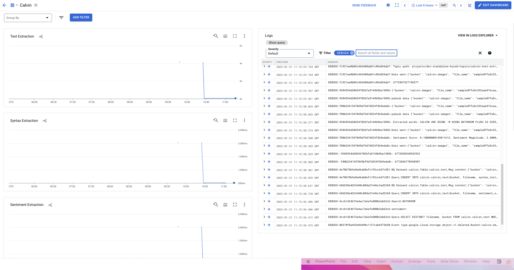

# Elevator Pitch

Look at the art of possible with GCP's optical text extraction, natural language processing and vision APIs. Extract, process, classify text from a large collection of images and assign labels to faces in the images.

# Summary

The following is an experiment with AI services and Cloud functions on GCP using a sample application.  We will be doing the following:-

 - Extract text from a large set of comic strips. We will focus on [Calvin and Hobbes](https://en.wikipedia.org/wiki/Calvin_and_Hobbes) for this example, but this could be any comic strip collection of images. 

 - Analyse and extract the syntax-parts of speech extraction of the extracted text
 - Analyse the sentiment of the extracted text using GCP's natural language processing.
 - Analyse the entities in the extracted text using GCP's natural language processing.
 - Detect face labels in the images using GCP's Vision API
 - Build a basic but working web interface to test and demo the working of these examples.
 - Importantly, we will also read the comics in the process.

From a Cloud design standpoint, we are also imposing some self-imposed technological constraints to test the powers of the Google Cloud Serverless platforms. The following are the design principles.

 - All code will be implemented directly in Cloud Functions. We will use gen 2, which uses Cloud Run under the hood. Technically, that means we can package this code into containers and run it on Cloud Run. 
 - Keep the application architecture simple and use separate functions for modular tasks. This effectively introduces a micro-services-like design. 
 - Use Pub/Sub as a message bus for the distributed and async processing.
 - Use cloud Functions to service any web frontend. We will skip using a load balancer for simplicity. Cloud functions already have a GCP-managed load balancer, and unless you use custom domains, you don't need a load balancer. It is easy to front this with a load balancer. 
 - File storage will be Google Cloud Storage (GCS).
 - Relational data storage will be done using Big Query. Cloud SQL or Cloud Spanner are better choices but they were discarded to reduce overall experimentation cost. Big Query was by far the most cost-effective option but it does have some limitations for this use-case when it comes to concurrent DML statements. See [Big Query Quotas](https://cloud.google.com/bigquery/quotas) for specifics. This can be fixed using a feature which is still in preview stage called [query queues](https://cloud.google.com/bigquery/docs/query-queues). For our experiments, we added some extra code to handle this issue. If we were to run this in production, Cloud SQL or Cloud Spanner is recomended. 

Here's the visual of the design we will implement:


At a high level, 
  * Image data arrives in a GCS bucket. This could via the cli or any other means. 
  * GCS Event processing is triggered to detect face labels from the image.
  * GCS Event processing is triggered to extract text from the image.
  * Extracted test is passed to pub/sub for:-
    * Syntax processing using NLP in a separate job.
    * Sentiment processing using to NLP in a separate job.
    * Entity processing using NLP in a separate job.
  * All processed information is stored in a database using a simplified schema by a data-writer job.
  * A separate job handles deletion events.
  * A simple web-based frontend for demo that shows the results and allows basic filtering.
  
# Implementation

## Pre-requisites

 * Admin access to a GCP project
 * Google Cloud CLI
 * Google Cloud storage CLI
 * BigQuery CLI
 * Python
 * Utiliites like curl, jq, git
 
 
## Pick/create a GCP project

We assume this is done on an empty project without any specific restrictions. us-east1 is the region used, but this could work in any region with those services. The region is hard coded in the code and so we don't recommend changing it. 

  * Authenticate to Google and make sure you have access to the Project. 
  
  * Set the project in the cli.
  ```
  gcloud config set project <project name>
  ```

  * Enable the APIs we need.
  ```
  for gcp_service in "documentai.googleapis.com" "cloudfunctions.googleapis.com" "cloudbuild.googleapis.com" "artifactregistry.googleapis.com" "eventarc.googleapis.com" "run.googleapis.com" "language.googleapis.com" "vision.googleapis.com"; do  gcloud services enable $gcp_service; done
  ```

  * Get a beverage and read this article. Some of these APIs can take up to 5 minutes to enable. Best to give them some time to activate.

## Setup the environment

  * Clone the repo. This has all the code you need for this demo. 
    ```
    git clone https://github.com/rax-incubate/gcp-image-processing-example-app
    ```

  * Setup your env variables.
    ```
    PROJECT_ID=$(gcloud config get-value project)
    PROJECT_NUMBER=$(gcloud projects list --filter="project_id:$PROJECT_ID" --format='value(project_number)')
    GCP_IMAGE_APP="<your git clone folder>"
    ```

## Storage Setup

  * Create bucket for the images. This can be named anything. This bucket needs to be publicly accessible as we will also use this in our public facing web interface.
    ```
    GCS_BUCKET='calvin-images'
    gsutil mb -l us-east1 gs://$GCS_BUCKET
    gsutil iam ch allUsers:objectViewer gs://$GCS_BUCKET
    ```

## Create pub sub topics

  * Create pub/sub topic for the text extraction.
    ```
    gcloud pubsub topics create images-text-extract \
     --message-retention-duration 3d \
     --project $PROJECT_ID 
    ```

      * (Optional) Create pub/sub subscription for debug and demo purposes. You only need this if you are pulling the messages outside of the code.
      ```
      gcloud pubsub subscriptions create extracted-text \
      --topic images-text-extract \
      --retain-acked-messages \
      --project $PROJECT_ID 
      ```

  * Create pub/sub topic for processed text that will be writted to the database.
    ```
    gcloud pubsub topics create images-data-writer \
     --message-retention-duration 3d \
     --project $PROJECT_ID 
    ```

      * (Optional)Create pub/sub subscription for debug/demo purposes.
      ```
      gcloud pubsub subscriptions create data-writer \
      --topic images-data-writer \
      --retain-acked-messages \
      --project $PROJECT_ID 
      ```

## Create BQ dataset and table

  * Create dataset.
    ```
    bq  --project_id $PROJECT_ID  mk images
    ```

  * Create table.
    ```
    bq --project_id $PROJECT_ID query --use_legacy_sql=false \
    'CREATE TABLE images.images_info ( 
      bucket STRING(256),
      filename STRING(256),
      syntax_text STRING(1024),
      sentiment_score NUMERIC,
      sentiment_magnitude NUMERIC,
      last_update DATETIME,
      entities ARRAY<STRUCT<name STRING, type STRING, score NUMERIC>>,
      face_labels ARRAY<STRUCT<description STRING, score NUMERIC, topicality NUMERIC>>
    );'
    ```

## Extract text from images

This service uses Document AI to extract text from an image. Document AIS has several features, including specialised processing forms such as 1040, driver's license, contract documents and more. For our use case, the standard Document OCR works, and that is what we will use. A GCS event is triggered when an object is uploaded to a bucket, and the triggered Cloud function passes the image to Document AI for processing. It then collects and sends the extracted text to a pub/sub topic.

  * Create a processor in Document AI. There is no glcoud equivalent for this. We are also assuming that the processor is in the US region. For this exercise, we recommend keeping this to US and the name of the processor the same as well. If you change this, you will have to change it in the code as well. 
    ```
    echo '{ "type": "OCR_PROCESSOR", "displayName": "app-images" }' > proc-request.json
    ```

    ```
    curl -X POST \
      -H "Authorization: Bearer $(gcloud auth print-access-token)" \
      -H "Content-Type: application/json; charset=utf-8" \
      -d @proc-request.json \
      "https://us-documentai.googleapis.com/v1/projects/$PROJECT_ID/locations/us/processors"
    ```

  * Getting the processor ID is hacky because the cli has no easy way. 
    ```
    cd $GCP_IMAGE_APP/extract-text
    DAI_PROC_ID=$(curl -s -X GET -H "Authorization: Bearer $(gcloud auth print-access-token)" -H "Content-Type: application/json; charset=utf-8" "https://us-documentai.googleapis.com/v1/projects/$PROJECT_ID/locations/us/processors" | jq  '.processors[].name' | sed 's/\// /g'  | awk '{print $6}' | sed 's/"//g')
    ```
      * If you don't have jq, get the ID and update it in the next step 
        ```
        curl -s -X GET -H "Authorization: Bearer $(gcloud auth print-access-token)" -H "Content-Type: application/json; charset=utf-8" "https://us-documentai.googleapis.com/v1/projects/$PROJECT_ID/locations/us/processors"
        ```

  * Grant IAM access to the KMS service account & compute engine service account

    ```
    KMS_SERVICE_ACCOUNT=$(gsutil kms serviceaccount -p $PROJECT_NUMBER)

    gcloud projects add-iam-policy-binding $PROJECT_ID \
    --member serviceAccount:$KMS_SERVICE_ACCOUNT \
    --role roles/pubsub.publisher

    gcloud iam service-accounts add-iam-policy-binding \
    $PROJECT_NUMBER-compute@developer.gserviceaccount.com \
    --member serviceAccount\
    --role roles/iam.serviceAccountUser
    ```
    
  * Update `env.yaml` with the right values.This file is passed to the cloud functions and the values show up as environment variables in the code. Leave DEBUGX to 1 for additional logging. View the env.yaml to make sure this formatted correctly.
    ```
    echo -e "PROJECT_ID: \"$PROJECT_ID\"\nPROJECT_NO: \"$PROJECT_NUMBER\"\nPROC_LOCATION: \"us\"\nPROC_ID: \"$DAI_PROC_ID\"\nTOPIC_ID: \"calvin-text-extract\"\nDEBUGX: \"1\"" > env.yaml
    cat env.yaml
    ```
      * Sample env.yaml
      ```
      PROJECT_ID: "calvin-h314"
      PROJECT_NO: "476719929030"
      PROC_LOCATION: "us"
      PROC_ID: "f5a19ce0555a6ced"
      TOPIC_ID: "images-text-extract"
      DEBUGX: "1"
      ```

  * Deploy the extract-text function. This function will extract text using OCR. 
    ```
    cd $GCP_IMAGE_APP/extract-text
    gcloud functions deploy extract-text \
     --gen2 \
     --runtime=python310 \
     --region=us-east1 \
     --source=. \
     --entry-point=new_image_file \
     --trigger-event-filters="type=google.cloud.storage.object.v1.finalized" \
     --trigger-event-filters="bucket=$GCS_BUCKET"  \
     --env-vars-file env.yaml \
     --project $PROJECT_ID
    ```

  * Unit test the function with a sample image. This repo
    ```
    gsutil cp sample.png gs://$GCS_BUCKET/sample.png
    ```

  * Review logs for function execution
    ```
    gcloud beta functions logs read extract-text \
     --gen2 \
     --limit=100 \
     --region=us-east1 \
     --project $PROJECT_ID
    ```
      * Sample output
      ```
      extract-text  2023-02-01 16:03:10.954  DEBUGX:88ddede4ff2a4f3c996cd25185eb280c:Data sent:{"bucket": "calvin-images", "file_name": "sample.png", "extracted_text": "EENIE, MEENIE, MINEY, MOE!\nCATCH A TIGER BY THE TOE!\nIF HE HOLLERS, UM.\u2026.. UH....\nHEH HEH...\nM\nWHO WRITES\nTHESE DUMB\nTHINGS ANYWAY?\n"}
      extract-text  2023-02-01 16:03:10.954  DEBUGX:88ddede4ff2a4f3c996cd25185eb280c: Topic path: projects/calvin-h314/topics/calvin-text-extract
      extract-text  2023-02-01 16:03:10.950  ,Bucket:calvin-images,File:sample.png
      extract-text  2023-02-01 16:03:10.950  THINGS ANYWAY?
      extract-text  2023-02-01 16:03:10.950  THESE DUMB
      ```

  * Delete the image. At this point we have the most basic of functions in place and the start of event stream.
    ```
    gsutil rm gs://$GCS_BUCKET/sample.png
    ```

## Extract syntax

Let's move to the language elements. GCP has two Natural language products. AutoML and Natural Language API. Auto ML is suited for more custom use cases. The Natural Language API does several things. In this step, we use the NLP API to analyse syntax and extract word tokens. The NLP syntax API also classifies the tokens by parts of speech. This is handy if you want to create automated search filter terms using commonly occurring words. We use this feature to extract the following types: "NOUN", "ADJ", "VERB". This extracted text is then passed to a pub/sub topic for data processing.

  * Update `env.yaml` with the right values. Leave DEBUGX to 1 for additional logging. View the env.yaml to make sure this formatted correctly.
    ```
    cd $GCP_IMAGE_APP/extract-syntax

    echo -e "PROJECT_ID: \"$PROJECT_ID\"\nPROJECT_NO: \"$PROJECT_NUMBER\"\nTOPIC_ID: \"images-data-writer\"\nDEBUGX: \"1\"" > env.yaml
    cat env.yaml
    ```
        * Sample env.yaml
        ```
        PROJECT_ID: "calvin-h314"
        PROJECT_NO: "476719929030"
        TOPIC_ID: "images-data-writer"
        DEBUGX: "1"
        ```

  * Deploy the extract-syntax function. 
    ```
    cd $GCP_IMAGE_APP/extract-syntax
    gcloud functions deploy extract-syntax \
     --gen2 \
     --runtime=python310 \
     --region=us-east1 \
     --source=. \
     --entry-point=new_text \
     --trigger-topic=images-text-extract  \
     --env-vars-file env.yaml \
     --retry \
     --project $PROJECT_ID
    ```

  * Review logs for function deployment. If there any errors, they will show up. We will do end to end tests later. 
    ```
    gcloud beta functions logs read extract-syntax \
     --gen2 \
     --limit=100 \
     --region=us-east1 \
     --project $PROJECT_ID
    ```

## Extract sentiment

The concept with sentiment analysis is the same as the syntax service. We use the NLP API to extract sentiment from the text. The use of sentiment for filtering varies by text quality and quantity. For some of these comic strips, there isn't enough data to provide accurate sentiment, but in general, this works. The sentiment score and magnitude are then passed to a pub/sub topic for data processing. 

  * Update `env.yaml` with the right values. Leave DEBUGX to 1 for additional logging. View the env.yaml to make sure this formatted correctly.
    ```
    cd $GCP_IMAGE_APP/extract-sentiment
    echo -e "PROJECT_ID: \"$PROJECT_ID\"\nPROJECT_NO: \"$PROJECT_NUMBER\"\nTOPIC_ID: \"images-data-writer\"\nDEBUGX: \"1\"" > env.yaml
    cat env.yaml
    ```
      * Sample env.yaml
      ```
      PROJECT_ID: "calvin-h314"
      PROJECT_NO: "476719929030"
      TOPIC_ID: "images-data-writer"
      DEBUGX: "1"
      ```

  * Deploy the extract-sentiment function. 
    ```
    cd $CLONE_FOLDER/extract-sentiment
    gcloud functions deploy extract-sentiment \
     --gen2 \
     --runtime=python310 \
     --region=us-east1 \
     --source=. \
     --entry-point=new_text \
     --trigger-topic=images-text-extract \
     --env-vars-file env.yaml \
     --retry \
     --project $PROJECT_ID
    ```

  * Review logs for function deployment. If there any errors, they will show up. We will do end to end tests later. 
    ```
    gcloud beta functions logs read extract-sentiment \
     --gen2 \
     --limit=100 \
     --region=us-east1 \
     --project $PROJECT_ID
    ```
## Extract entities

Similar to the syntax service, this service uses the NLP API to extract entities from the extracted text. Entities are similar to the syntax, but instead of the entire parts of speech, this extracts specific entities like proper nouns, location and similar. The entity type, salience score and the metadata for entities for all text are then passed to a pub/sub topic for data processing. 

  * Update `env.yaml` with the right values. Leave DEBUGX to 1 for additional logging. View the env.yaml to make sure this formatted correctly.
    ```
    cd $GCP_IMAGE_APP/extract-sentiment
    echo -e "PROJECT_ID: \"$PROJECT_ID\"\nPROJECT_NO: \"$PROJECT_NUMBER\"\nTOPIC_ID: \"calvin-data-writer\"\nDEBUGX: \"1\"" > env.yaml
    cat env.yaml
    ```
      * Sample env.yaml
      ```
      PROJECT_ID: "calvin-h314"
      PROJECT_NO: "476719929030"
      TOPIC_ID: "images-data-writer"
      DEBUGX: "1"
      ```

  * Deploy the extract-entities function. 
    ```
    cd $CLONE_FOLDER/extract-entities
    gcloud functions deploy extract-entities \
     --gen2 \
     --runtime=python310 \
     --region=us-east1 \
     --source=. \
     --entry-point=new_text \
     --trigger-topic=images-text-extract \
     --env-vars-file env.yaml \
     --retry \
     --project $PROJECT_ID
    ```


## Detect face data

We use the Vision API for this purpose. Unlike the previous one, this receives the event from GCS and processes the image in GCS. There are quite a few things we can do with Vision API. For example, you can detect faces using user defined labels like a person's name.  In this example, we are sticking to the Google generated label data such "Gesture" or "Organ" or "Cartoon".

  * Update `env.yaml` with the right values. Leave DEBUGX to 1 for additional logging. View the env.yaml to make sure this formatted correctly.
    ```
    cd $GCP_IMAGE_APP/detect-faces
    echo -e "PROJECT_ID: \"$PROJECT_ID\"\nPROJECT_NO: \"$PROJECT_NUMBER\"\nTOPIC_ID: \"images-data-writer\"\nDEBUGX: \"1\"" > env.yaml
    cat env.yaml
    ```
      * Sample env.yaml
      ```
      PROJECT_ID: "calvin-h314"
      PROJECT_NO: "476719929030"
      TOPIC_ID: "images-data-writer"
      DEBUGX: "1"
      ```

  * Deploy the detect-faces function. 
    ```
    cd $CLONE_FOLDER/detect-faces
    gcloud functions deploy detect-faces \
     --gen2 \
     --runtime=python310 \
     --region=us-east1 \
     --source=. \
     --entry-point=new_image_file \
     --trigger-event-filters="type=google.cloud.storage.object.v1.finalized" \
     --trigger-event-filters="bucket=$GCS_BUCKET"  \
     --env-vars-file env.yaml \
     --retry \
     --project $PROJECT_ID
    ```
  
  * Review logs for function deployment. If there any errors, they will show up. We will do end to end tests later. 
    ```
    gcloud beta functions logs read detect-faces \
     --gen2 \
     --limit=100 \
     --region=us-east1 \
     --project $PROJECT_ID
    ```

## Data writer 

This service does a simple job of taking values and writing them into Big Query. Think of this as the data service that can be replaced with something else. For example, write to Cloud SQL or Spanner. You can also have multiple data-writers.  The code does have some rudimentary retry capabilities to workaround the Big Query DML implementation.  A more advanced approach would be to batch these writes together and trigger data jobs in batches.  Also for simplicity we structured all the image information into one BQ table and this could be decoupled into individual tables.

  * Update `env.yaml` with the right values. Leave DEBUGX to 1 for additional logging. View the env.yaml to make sure this formatted correctly.
    ```
    cd $GCP_IMAGE_APP/data-writer
    echo -e "PROJECT_ID: \"$PROJECT_ID\"\nPROJECT_NO: \"$PROJECT_NUMBER\"\nBQ_DATASET_ID: \"images\"\nBQ_TABLE_ID: \"images_info\"\nDEBUGX: \"1\"" > env.yaml
    cat env.yaml
    ```
      * Sample env.yaml
      ```
      PROJECT_ID: "calvin-h314"
      PROJECT_NO: "476719929030"
      BQ_DATASET_ID: "images"
      BQ_TABLE_ID: "images_info"
      DEBUGX: "1"
      ```
  * Deploy the data-writer function. 
    ```
    cd $CLONE_FOLDER/data-writer
    gcloud functions deploy data-writer \
     --gen2 \
     --runtime=python310 \
     --region=us-east1 \
     --source=. \
     --entry-point=new_text \
     --trigger-topic=images-data-writer  \
     --env-vars-file env.yaml \
     --retry \
     --project $PROJECT_ID
    ```

  * Review logs for function deployment. If there any errors, they will show up. We will do end to end tests later. 
    ```
    gcloud beta functions logs read data-writer \
     --gen2 \
     --limit=100 \
     --region=us-east1 \
     --project $PROJECT_ID
    ```


## Process image delete eventa

This service takes care of images that are deleted from the GCS bucket. Again this is built separately to allow for a different process for deletion. In this example, we are just cleaning up the table, but this could easily do other things like update some 3rd party system or rebuild a cache. 

  * Update `env.yaml` with the right values. Leave DEBUGX to 1 for additional logging. View the env.yaml to make sure this formatted correctly.
    ```
    cd $GCP_IMAGE_APP/data-deleter
    echo -e "PROJECT_ID: \"$PROJECT_ID\"\nPROJECT_NO: \"$PROJECT_NUMBER\"\nBQ_DATASET_ID: \"images\"\nBQ_TABLE_ID: \"images_info\"\nDEBUGX: \"1\"" > env.yaml
    cat env.yaml
    ```
      * Sample env.yaml
      ```
      PROJECT_ID: "calvin-h314"
      PROJECT_NO: "476719929030"
      BQ_DATASET_ID: "images"
      BQ_TABLE_ID: "images_text"
      DEBUGX: "1"

  * Deploy the data-deleter function. 
    ```
    cd $GCP_IMAGE_APP/data-deleter
    gcloud functions deploy data-deleter \
     --gen2 \
     --runtime=python310 \
     --region=us-east1 \
     --source=. \
     --entry-point=delete_image_data \
     --trigger-event-filters="type=google.cloud.storage.object.v1.deleted" \
     --trigger-event-filters="bucket=$GCS_BUCKET"  \
     --env-vars-file env.yaml \
     --project $PROJECT_ID
    ```

  * Review logs for function deployment. If there any errors, they will show up. We will do end to end tests later. 
    ```
    gcloud beta functions logs read data-deleter \
     --gen2 \
     --limit=100 \
     --region=us-east1 \
     --project $PROJECT_ID
    ```

## Web frontend
This is a simple service that provides a web interface to demonstrate the working of the whole application. This function does two things. It lists all the images in the database. It also allows searching using keywords or sentiment types. We have a standalone function for this example, but we could put a load balancer in front of it and make this part of a more extensive application or a custom domain. 

  * Update `env.yaml` with the right values. Leave DEBUGX to 1 for additional logging. View the env.yaml to make sure this formatted correctly.
    ```
    cd $GCP_IMAGE_APP/web-ui
    echo -e "PROJECT_ID: \"$PROJECT_ID\"\nPROJECT_NO: \"$PROJECT_NUMBER\"\nBQ_DATASET_ID: \"images\"\nBQ_TABLE_ID: \"images_info\"\nDEBUGX: \"1\"" > env.yaml
    cat env.yaml
    ```
      * Sample env.yaml
      ```
      PROJECT_ID: "calvin-h314"
      PROJECT_NO: "476719929030"
      BQ_DATASET_ID: "images"
      BQ_TABLE_ID: "images_info"
      DEBUGX: "1"
  
  * Deploy the web-ui function. 
    ```
    cd $GCP_IMAGE_APP/web-ui
    gcloud functions deploy web-ui \
     --gen2 \
     --allow-unauthenticated \
     --runtime=python310 \
     --region=us-east1 \
     --source=. \
     --entry-point=new_request \
     --trigger-http \
     --env-vars-file env.yaml \
     --project $PROJECT_ID
    ```

    * Test the URI. This URI will not return any results but it confirms the working of the function.
    ```
    WEB_URI=$(gcloud functions describe web-ui  --region=us-east1  --project $PROJECT_ID |grep uri| awk '{print $2}')
    curl -s $WEB_URI |grep "No results found"
    ```


## Metrics and monitors

One of the challenges of a micro-services architecture is to build observability into the application. When one of these many micro-services misbehaves, how do you find that out and how do you troubleshoot? There are two approaches we have taken

  * Build a custom dashboard just for this application. See cloud-monitoring-dashboard.json for the metrics dashboard that can be imported. If you have stayed with the naming convention of the functions in this article, this should work without any changes.  Here's a screenshot:-




  * To create this dashboard, run the following
  ```
  cd $GCP_IMAGE_APP/monitoring
  gcloud monitoring dashboards create \
  --project $PROJECT_ID\
  --config-from-file cloud-monitoring-dashboard.json
  ```

  * Go to the [web console](https://console.cloud.google.com/monitoring/dashboards) and view your dashboard

  * If you want the logs, the code requires some instrumentation in the form of debug messages. Anything you print to the stdout, you can get in logs. You can also incorporate things like open telemetry into this. For simplicity, we have stayed with simple print statements to capture key stages of the code execution. Cloud Logging does the rest, and you can query logs using this. 
  ```
  (resource.type = "cloud_run_revision"
  resource.labels.service_name = "extract-text"
  resource.labels.location = "us-east1") OR 
  (resource.type = "cloud_run_revision"
  resource.labels.service_name = "extract-syntax"
  resource.labels.location = "us-east1") OR 
  (resource.type = "cloud_run_revision"
  resource.labels.service_name = "extract-sentiment"
  resource.labels.location = "us-east1")  OR 
  (resource.type = "cloud_run_revision"
  resource.labels.service_name = "data-writer"
  resource.labels.location = "us-east1")  OR 
  (resource.type = "cloud_run_revision"
  resource.labels.service_name = "data-deleter"
  resource.labels.location = "us-east1")  OR 
  (resource.type = "cloud_run_revision"
  resource.labels.service_name = "web-ui"
  resource.labels.location = "us-east1")
  severity>=DEFAULT
  ```

## Test with lots of data

If you have reached this far, you have a fully working application but to confirm let's do an end-to-end test.

  * Run the following end-to-end test. This will upload a sample image and put it through the different stages of text extraction, syntax extraction, sentiment analysis and finally, delete the image. If you used a different GCS Bucket, update the GS_BUCKET variable in the code. If you are doing this in a demo, it is most likely to fail :-) 
  ```
  cd $GCP_IMAGE_APP/tests
  python end-to-end-test.py 
  ```
  Expected output:
  ```
  gsutil test file upload sample9fed94a72f3d454aba227a068704a33f.png: Success
  Waiting 7 seconds...
  Received event in Text extract service: Success
  Waiting 7 seconds...
  Text extraction: Success
  Text syntax extraction: Success
  Text sentiment extraction: Success
  Web search: Success
  gsutil test file delete: Success
  Waiting 7 seconds...
  Data Deleter: Success
  ```

  * If the above works, time to make this work with 100 images.
  ```
  gsutil -q cp -c gs://calvin.tty0.me/calvin-9{0..9}{0..9}.png  gs://$GCS_BUCKET/
  ```

  * Time to leave the boring console and code to go read some of the comics using the different URLs below. You can experiment with other searches.  
  ```
  uri=$(gcloud functions describe web-ui --project $PROJECT_ID  --region=us-east1  --format='value(serviceConfig.uri)')
  for s in "search=FLUSH" "search=Cookies" "sentiment=positive" "sentiment=negative" "entity_name=swimming" "entity_name=dynamite" "entity_type=location"; do echo $uri/?$s; done 
  ```

  * If we need more images. This has 900+ images. You can test with all but your cost may go up a bit.  Note, you might see some errors with concurrency here. BQ supports 100 concurrent INSERT statements and so anything above will fail unless you queue them in code. The code does do some retries to avoid this but it won't work in all cases. The limit for DMLs like DELETE is 20 as well. 
  ```
  gsutil -q cp -c gs://calvin.tty0.me/calvin-{6,7,8}{0..9}{0..9}.png  gs://$GCS_BUCKET/
  ```

## Cost governance

Overall, running the above should not cost more than 5 to 10 USD per month. Google Cloud is very cost-effective when it comes to experimentation of this kind. The costs do go up when you scale. Here's some more information.

  * Cloud functions are free up to 2 million invocations. Beyond that it is 0.40 USD per million. More at [](https://cloud.google.com/functions/pricing)

  * Cloud storage is $0.020 per Gigabyte per month. More at [](https://cloud.google.com/storage/pricing)

  * For Big Query, 1 TB of queries and 10GB of storage is free every month. Note, something Spanner or Cloud SQL will be a lot more in cost. 
 
  * For Cloud Logging, 50 GiB of logs ingestion is free and if you stick to default retention (30 days), they don't incur any cost.  Cost of ingestion beyond 50GB is 0.50/GiB 

  * For DocumentAI, OCR on 1000 images will cost about 1.5 USD More at [](https://cloud.google.com/document-ai/pricing)

  * For Cloud Natural Language, syntax & sentiment analysis is a bit more complex to asses. 5000 Units per month are free which equates to 5 million characters processed. We will be well within that tier for this example. 
    * Beyond that, syntax analyis costs 0.5 USD per 1000 units & sentiment analysis costs 1 USD per 1000 units
    * More at [](https://cloud.google.com/natural-language/pricing)
 
  * All said, it is always good to clean up after you are done playing.

  * Cleanup the functions
  ```
  gcloud functions delete web-ui --quiet --gen2 --region=us-east1 --project $PROJECT_ID
  gcloud functions delete data-deleter --quiet --gen2  --region=us-east1 --project $PROJECT_ID
  gcloud functions delete data-writer --quiet --gen2 --region=us-east1 --project $PROJECT_ID
  gcloud functions delete extract-sentiment --quiet --gen2 --region=us-east1 --project $PROJECT_ID
  gcloud functions delete extract-syntax --quiet --gen2 --region=us-east1 --project $PROJECT_ID
  gcloud functions delete extract-text --quiet --gen2 --region=us-east1 --project $PROJECT_ID
  ```

  * Delete the pub/sub topics and subscriptions
  ```
  gcloud pubsub subscriptions delete extracted-text --project $PROJECT_ID 
  gcloud pubsub subscriptions delete data-writer --project $PROJECT_ID 
  gcloud pubsub topics delete images-text-extract --project $PROJECT_ID 
  gcloud pubsub topics delete images-data-writer --project $PROJECT_ID
  ```

  * Cleanup the storage bucket
  ```
  gsutil rm -r gs://$GCS_BUCKET
  bq --project_id $PROJECT_ID query --use_legacy_sql=false 'DROP TABLE images.images_info;'
  bq  --project_id $PROJECT_ID  rm -f images
  ```

  * Get the processor ID for calvin-images. There is no method in the API to get this using the human friendly name. 
  ```
  curl -X GET -H "Authorization: Bearer $(gcloud auth print-access-token)" \
     -H "Content-Type: application/json; charset=utf-8"\
    "https://us-documentai.googleapis.com/v1/projects/$PROJECT_ID/locations/us/processors"

  ```

  * Delete the processor in Document AI. There is no glcoud equivalent for this
  ```
  curl -X DELETE \
    -H "Authorization: Bearer $(gcloud auth print-access-token)" \
    -H "Content-Type: application/json; charset=utf-8" \
    "https://us-documentai.googleapis.com/v1/projects/$PROJECT_ID/locations/us/processors/<REPLACE WITH PROCESSOR ID FROM ABOVE>"
  ```

## Lessons Learnt

 * Cloud AI is fun. Not the same as Calvin and Hobbes but fun :-)

 * Start simple and then add to it. It is amazing what momentum brings when you have little wins.  Conversely, knowing when to stop is important as well.  There are lots of these cool APIs but not all will be revelant for your examples. 

 * GCP services are great to experiment with. There are lots of online examples to get you started.

 * When using Functions, you must consider how you will operationalise the setup for scale. For example, using environment variables to trigger debug logging or creating an execution ID that allows you to track end-to-end is very useful. 
 
 * A logging strategy on how to use logs for troubleshooting is essential, and so i log retention for historical analysis. You could invest in [Opentelemtry](https://cloud.google.com/trace/docs/setup/python-ot)
 
 * Some batching is required for this to scale and be more efficient. For example, INSERTS or DELETES to Big query will run into limits if you don't batch.  Cloud function execution will also be optimized if you batch.  It will require change in logic to where instead of a pub/sub trigger, these functions will have to poll the topic in either a window and only write when a threshold is reached.

## What next?

We suggest the following :-

 * Find a data set.

   * [Oxford-IIIT Pet Images Dataset](https://www.robots.ox.ac.uk/~vgg/data/pets/): This pet image dataset features many categories with 200+ images for each class. 
   
   * [Plant Image Analysis](https://www.quantitative-plant.org/dataset): This is a compilation of over 1 million images of plants, with the choice of roughly 11 species of plants. 
   
   * [Celebfaces](http://mmlab.ie.cuhk.edu.hk/projects/CelebA.html): This image dataset features over 200,000 images of celebrities.
   
   * [Google’s Open Images](https://ai.googleblog.com/2016/09/introducing-open-images-dataset.html): One of the largest of the image datasets consisting of ~9 million URLs to images that have been annotated with labels spanning over 6000 categories and the images are listed as having a Creative Commons Attribution.

   * You might have your own. Maybe your photo collection.

 * Fork the repo

 * Build your own code with the example above

 * Share your experiments