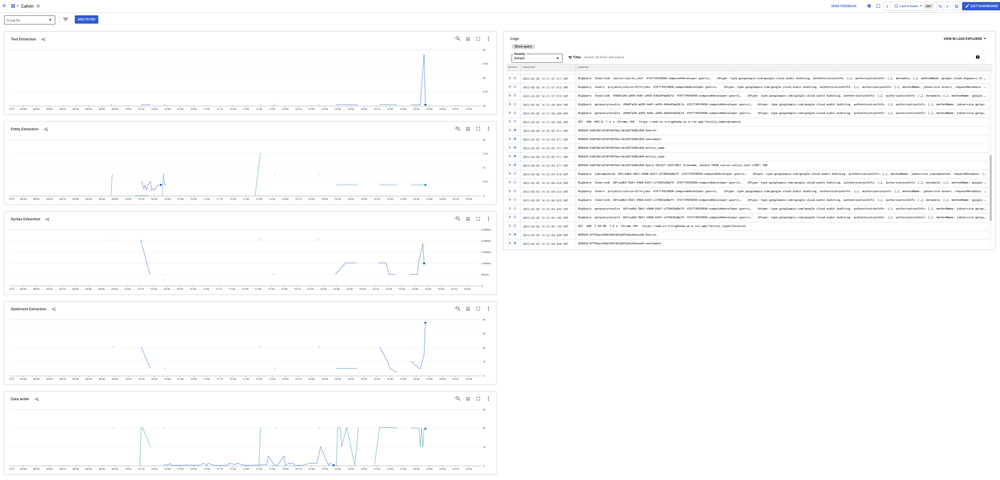

# Summary

This tutorial focuses on the use GCP's AI services to do following 

 - Extract Text from a large array of comic strips. We will focus on [Calvin and Hobbes](https://en.wikipedia.org/wiki/Calvin_and_Hobbes) for this example but this could be any comic strip.

 - Analyse syntax of the extracted text. In case of syntax, we mean words and use the automated parts of speech extraction in GCP's natural language processing

 - Analyse sentiment of the extracted text using GCP's natural language processing 

 - Build a basic but working web-interface to test and demo the working of these examples

 - Other areas of interest which maybe developed in the future
  - Extract entities in text
  - Detect faces in the images

We are also imposing some self-imposed technological constraints to test the powers of the GCP serverless platforms. 

 - All code will be in implemented in Cloud Functions. We will use version 2 which uses Cloud Run under the hood.  Technically, that means, we can package this code into containers and run it on Cloud Run.

 - Keep the code simple and use Cloud Functions for single tasks. This also introduces a micro-services like design. 

 - Pub/Sub will provide the message bus for the distributed processing 

 - Cloud Functions will also service any web-frontend

 - File storage will be Google Cloud Storage (GCS)

 - Relational data storage will be done using Big Query. We can use Cloud SQL or Cloud Spanner but they were discarded in order to reduce cost. 


Here's the design we will implement


At an high level, 
  * Image data arrives in a GCP bucket
  * Event processing is triggered to extract text from the image 
  * Extracted text is sent to NLP for syntax processing
  * Extracted text is sent to NLP for sentiment processing
  * All information are stored in a database
  * A web based frontend shows the results and allows demos

# Implementation

## Setup the environment

  * Clone the repo
    ```
    git clone https://github.com/RSS-Engineering/calvin
    ```

  * Authenticate to Google and make sure you have access to a Project

  * Setup your env variables
    ```
    PROJECT_ID=$(gcloud config get-value project)
    PROJECT_NUMBER=$(gcloud projects list --filter="project_id:$PROJECT_ID" --format='value(project_number)')
    CLONE_FOLDER="<your folder>"
    ```

## Storage Setup

  * Create bucket for the images. This bucket needs to be publicly accessible as we will also use this in our public facing web interface
    ```
    gsutil mb -l us-east1 gs://calvin-images
    gsutil iam ch allUsers:objectViewer gs://calvin-images
    ```

## Create pub sub topics


  * Create pub/sub topic for the text extraction 
    ```
    gcloud pubsub topics create calvin-text-extract \
     --message-retention-duration 3d \
     --project $PROJECT_ID 
    ```

    * (Optional) Create pub/sub subscription for debug and demo purposes
    ```
     gcloud pubsub subscriptions create extracted-text \
     --topic calvin-text-extract \
     --retain-acked-messages \
     --project $PROJECT_ID 
    ```

  * Create pub/sub topic for processed text that will be writted to the database
    ```
    gcloud pubsub topics create calvin-data-writer \
     --message-retention-duration 3d \
     --project $PROJECT_ID 
    ```

    * (Optional)Create pub/sub subscription for debug/demo purposes
      ```
      gcloud pubsub subscriptions create data-writer \
      --topic calvin-data-writer \
      --retain-acked-messages \
      --project $PROJECT_ID 
      ```

## Create BQ dataset and table

  * Create dataset
    ```
    bq  --project_id $PROJECT_ID  mk calvin
    ```

  * Create table
    ```
    bq --project_id $PROJECT_ID query --use_legacy_sql=false \
    'CREATE TABLE calvin.calvin_text ( 
      bucket STRING(256), 
      filename STRING(256), 
      syntax_text STRING(1024) ,
      sentiment_score NUMERIC ,
      sentiment_magnitude NUMERIC ,
      last_update DATETIME,
      );'
    ```

## Extract text from images

  * Grant IAM access to the KMS service account
    ```
    SERVICE_ACCOUNT=$(gsutil kms serviceaccount -p $PROJECT_NUMBER)

    gcloud projects add-iam-policy-binding $PROJECT_ID \
    --member serviceAccount:$SERVICE_ACCOUNT \
    --role roles/pubsub.publisher
    ```

  * Create a processor in Document AI. There is no glcoud equivalent for this
    ```
    tee proc-request.json <<EOF
    {
    "type": "Document OCR",
    "displayName": "calvin-images"
    }
    EOF
    ```

    ```
    curl -X POST \
      -H "Authorization: Bearer $(gcloud auth print-access-token)" \
      -H "Content-Type: application/json; charset=utf-8" \
      -d @proc-request.json \
      "https://us-documentai.googleapis.com/v1/projects/$PROJECT_ID/locations/us/processors"
    ```

  * Update `env.yaml` with the right values. Leave DEBUGX to 1 for additional logging.
    ```
    PROJECT_ID: "<your project id>"
    PROJECT_NO: "<your project no>"
    PROC_LOCATION: us
    PROC_ID: 99abb1af27652b15
    TOPIC_ID: calvin-text-extract
    DEBUGX: "1"
    ```

  * Deploy the extract-text function. This function will extract text using OCR. 
    ```
    cd $CLONE_FOLDER/extract-text
    gcloud functions deploy extract-text \
     --gen2 \
     --runtime=python310 \
     --region=us-east1 \
     --source=. \
     --entry-point=new_image_file \
     --trigger-event-filters="type=google.cloud.storage.object.v1.finalized" \
     --trigger-event-filters="bucket=calvin-images"  \
     --env-vars-file env.yaml \
     --project $PROJECT_ID
    ```

  * Unit test the function with a sample image 
    ```
    gsutil cp sample.png gs://calvin-images/sample.png
    ```

  * Review logs for function execution
    ```
    gcloud beta functions logs read extract-text \
     --gen2 \
     --limit=100 \
     --region=us-east1 \
     --project $PROJECT_ID
    ```

  * Check pub/sub for topic update
    ```
    gcloud pubsub subscriptions pull extracted-text --project $PROJECT_ID 
    ```

## Extract syntax

This service uses the NLP API to extract word tokens. See below for code snippets

  * Update `env.yaml` with the right values
    ```
    PROJECT_ID: "<your project id>"
    PROJECT_NO: "<your project no>"
    PROC_LOCATION: us
    SUBSCRIPTION_ID: extracted-text
    SUBSCRIPTION_TIMEOUT: "10"
    TOPIC_ID: "calvin-data-writer"
    DEBUGX: "1"
    ```

  * Deploy the extract-syntax function. 
    ```
    cd $CLONE_FOLDER/extract-syntax
    gcloud functions deploy extract-syntax \
     --gen2 \
     --runtime=python310 \
     --region=us-east1 \
     --source=. \
     --entry-point=new_text \
     --trigger-topic=calvin-text-extract  \
     --env-vars-file env.yaml \
     --retry \
     --project $PROJECT_ID
    ```

  * Review logs for function execution
    ```
    gcloud beta functions logs read extract-syntax \
     --gen2 \
     --limit=100 \
     --region=us-east1 \
     --project $PROJECT_ID
    ```

## Extract sentiment

This service uses the NLP API to extract sentiment from the extracted text. See below for code snippets

  * Update env.yaml with the right values
    ```
    PROJECT_ID: "<your project id>"
    PROJECT_NO: "<your project no>"
    PROC_LOCATION: us
    SUBSCRIPTION_ID: extracted-text
    SUBSCRIPTION_TIMEOUT: "10"
    TOPIC_ID: "calvin-data-writer"
    DEBUGX: "1"
    ```

  * Deploy the extract-sentiment function. 
    ```
    cd $CLONE_FOLDER/extract-sentiment
    gcloud functions deploy extract-sentiment \
     --gen2 \
     --runtime=python310 \
     --region=us-east1 \
     --source=. \
     --entry-point=new_text \
     --trigger-topic=calvin-text-extract \
     --env-vars-file env.yaml \
     --retry \
     --project $PROJECT_ID
    ```

  * Review logs for function execution
    ```
    gcloud beta functions logs read extract-sentiment \
     --gen2 \
     --limit=100 \
     --region=us-east1 \
     --project $PROJECT_ID
    ```
  
## Data writer 

This service does a simple job of taking values and writing it into Big Query. Think of this as the data service that can be replaced with something else. For example write to Cloud SQL or Spanner. You can also have multiple data-writers.


  * Update env.yaml with the values
    ```
    PROJECT_ID: "<your project id>"
    PROJECT_NO: "<your project no>"
    BQ_DATASET_ID: "calvin"
    BQ_TABLE_ID: "calvin_text"
    DEBUGX: "1"
    ```

  * Deploy the data-writer function. 
    ```
    cd $CLONE_FOLDER/data-writer
    gcloud functions deploy data-writer \
     --gen2 \
     --runtime=python310 \
     --region=us-east1 \
     --source=. \
     --entry-point=new_text \
     --trigger-topic=calvin-data-writer  \
     --env-vars-file env.yaml \
     --retry \
     --project $PROJECT_ID
    ```

  * Review logs for function execution
    ```
    gcloud beta functions logs read data-writer \
     --gen2 \
     --limit=100 \
     --region=us-east1 \
     --project $PROJECT_ID
    ```


## Process image delete eventa

This service takes care of images that are deleted from the GCS bucket. Again this is built separately to allow for different process for deletion. In this example, we are just cleaning up the table but this could easily do other things like update some 3rd party system or rebuild a cache etc. 

  * Update env.yaml with the right values
    ```
    PROJECT_ID: "<your project id>"
    PROJECT_NO: "<your project no>"
    BQ_DATASET_ID: "calvin"
    BQ_TABLE_ID: "calvin_text"
    DEBUGX: "1"
    ```

  * Deploy the data-deleter function. 
    ```
    cd $CLONE_FOLDER/data-deleter
    gcloud functions deploy data-deleter \
     --gen2 \
     --runtime=python310 \
     --region=us-east1 \
     --source=. \
     --entry-point=delete_image_data \
     --trigger-event-filters="type=google.cloud.storage.object.v1.deleted" \
     --trigger-event-filters="bucket=calvin-images"  \
     --env-vars-file env.yaml \
     --project $PROJECT_ID
    ```

  * Review logs for function execution
    ```
    gcloud beta functions logs read data-deleter \
     --gen2 \
     --limit=100 \
     --region=us-east1 \
     --project $PROJECT_ID
    ```

## Web frontend
This is a simple service that provides a web interface to demonstrate the working of the the whole application. This function does two things. It lists all the images in the database. It also allows searching using the keywords or sentiment type.  For this example, we have a standalone function but we could put a load balancer in front it and make this part of larger application or custom domain. 


  * Deploy the web-ui function. 
    ```
    cd $CLONE_FOLDER/web-ui
    gcloud functions deploy web-ui \
     --gen2 \
     --allow-unauthenticated \
     --runtime=python310 \
     --region=us-east1 \
     --source=. \
     --entry-point=new_request \
     --trigger-http \
     --env-vars-file env.yaml \
     --project $PROJECT_ID
    ```

  
## Metrics and monitors

One of the challenges of a micro-services architecture is to build observability into the application. When one of these many micro-services mis-behaves how do you find that out and how do you troubleshoot. There are two approaches we have taken

  * Build custom dashboard just for this application. See cloud-monitoring-dashboard.json for metrics dashboard that can be imported. If you have stayed with the naming convention of the functions this should work without any changes. 




  * The code requires some instrumentation in the form of debug messages. You can also incorporate things like open telemetry into this. For the sake of simplicity we have stayed with simple print statements to capture key stages of the code execution. Cloud Logging does the rest and you can query logs using this. 
    ```
    (resource.type = "cloud_run_revision"
    resource.labels.service_name = "extract-text"
    resource.labels.location = "us-east1") OR 
    (resource.type = "cloud_run_revision"
    resource.labels.service_name = "extract-syntax"
    resource.labels.location = "us-east1") OR 
    (resource.type = "cloud_run_revision"
    resource.labels.service_name = "extract-sentiment"
    resource.labels.location = "us-east1")  OR 
    (resource.type = "cloud_run_revision"
    resource.labels.service_name = "data-writer"
    resource.labels.location = "us-east1")  OR 
    (resource.type = "cloud_run_revision"
    resource.labels.service_name = "data-deleter"
    resource.labels.location = "us-east1")  OR 
    (resource.type = "cloud_run_revision"
    resource.labels.service_name = "web-ui"
    resource.labels.location = "us-east1")
    severity>=DEFAULT
    ```

## Test with lots of data

If you have reached this far, you have a fully working application but to confirm let's do a test

 * Run the following end-to-end test
  ```
  ```


 * If the above works, time to make this work at scale
  ```
  ```

